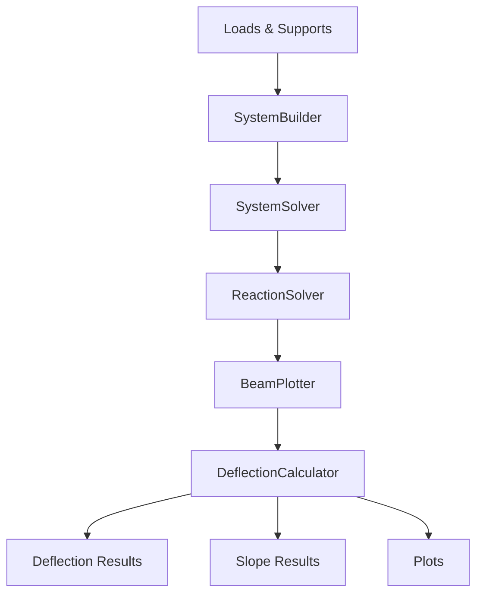

# DeflectionCalculator Class Documentation

## Overview

The `DeflectionCalculator` class extends the mechanics package to calculate beam deflection based on the results from the existing analysis classes. It uses double integration of the bending moment diagram to compute deflection and slope profiles along the beam.

## Key Features

- **Automatic deflection calculation** using double integration of M/(EI)
- **Default E modulus** of 210000 N/mm² (typical for steel)
- **Inertia input in cm⁴** with automatic conversion to mm⁴
- **Span-by-span calculation** to respect boundary conditions
- **Comprehensive plotting** capabilities for deflection and slope diagrams
- **Integration with existing classes** (SystemBuilder, SystemSolver, BeamPlotter)

## Class Structure

### Constructor

```python
DeflectionCalculator(
    beam_plotter: BeamPlotter,
    e_modulus: float = 210000,
    inertia: float = 1.0,
    num_points: int = 2000
)
```

**Parameters:**
- `beam_plotter`: BeamPlotter instance containing solved system and moment data
- `e_modulus`: Elastic modulus in N/mm² (default: 210000 for steel)
- `inertia`: Moment of inertia in cm⁴ (automatically converted to mm⁴)
- `num_points`: Number of evaluation points for calculation (default: 2000)

**Initialization Process:**
1. Stores the beam plotter reference
2. Sets material properties (E modulus and inertia)
3. Converts inertia from cm⁴ to mm⁴ (multiplies by 10000)
4. Ensures moment data is available from the beam plotter

---

## Core Methods

### 1. `_calculate_deflection()`

**Purpose:** Performs the main deflection calculation using double integration

**Process:**
1. **Calculates M/(EI):** Divides moment by (E × I) for integration
2. **Span-by-span processing:** Handles each span separately to respect boundary conditions
3. **First integration:** Computes slope = ∫(M/(EI))dx using trapezoidal integration
4. **Second integration:** Computes deflection = ∫slope dx using trapezoidal integration
5. **Boundary condition correction:** Ensures deflection = 0 at supports

**Mathematical Basis:**
```
d²y/dx² = M/(EI)  (differential equation of beam deflection)
slope = dy/dx = ∫(M/(EI))dx
deflection = y = ∫slope dx
```

**Boundary Conditions:**
- Deflection = 0 at all supports
- Linear correction applied to maintain consistency

### 2. `deflection` (Property)

**Returns:** numpy array of deflection values in mm

**Usage:**
```python
deflection_values = deflection_calc.deflection
```

### 3. `slope` (Property)

**Returns:** numpy array of slope values in radians

**Usage:**
```python
slope_values = deflection_calc.slope
```

### 4. `get_max_deflection()`

**Purpose:** Finds the maximum deflection and its location

**Returns:** Tuple of (max_deflection_mm, x_position_mm)

**Example:**
```python
max_deflection, max_pos = deflection_calc.get_max_deflection()
print(f"Max deflection: {max_deflection:.6f} mm at position {max_pos:.1f} mm")
```

### 5. `get_deflection_at_position(position)`

**Purpose:** Gets deflection at a specific position along the beam

**Parameters:**
- `position`: Position along the beam in mm

**Returns:** Deflection value in mm

**Example:**
```python
mid_deflection = deflection_calc.get_deflection_at_position(10)
print(f"Deflection at 10 mm: {mid_deflection:.6f} mm")
```

### 6. `get_slope_at_position(position)`

**Purpose:** Gets slope at a specific position along the beam

**Parameters:**
- `position`: Position along the beam in mm

**Returns:** Slope value in radians

**Example:**
```python
mid_slope = deflection_calc.get_slope_at_position(10)
print(f"Slope at 10 mm: {mid_slope:.6f} rad")
```

---

## Plotting Methods

### 1. `plot_deflection(ax=None, **kwargs)`

**Purpose:** Creates a deflection diagram plot

**Parameters:**
- `ax`: Matplotlib axes (optional, creates new figure if None)
- `**kwargs`: Additional plotting arguments

**Returns:** Matplotlib axes object

**Default Styling:**
- Color: Red
- Linewidth: 2
- Label: "Deflection"
- X-axis: Position [mm]
- Y-axis: Deflection [mm]

### 2. `plot_slope(ax=None, **kwargs)`

**Purpose:** Creates a slope diagram plot

**Parameters:**
- `ax`: Matplotlib axes (optional, creates new figure if None)
- `**kwargs`: Additional plotting arguments

**Returns:** Matplotlib axes object

**Default Styling:**
- Color: Purple
- Linewidth: 2
- Label: "Slope"
- X-axis: Position [mm]
- Y-axis: Slope [rad]

### 3. `plot_all(figsize=(12, 8))`

**Purpose:** Creates a comprehensive plot with both deflection and slope diagrams

**Parameters:**
- `figsize`: Figure size tuple (width, height) in inches

**Returns:** Tuple of (figure, (deflection_ax, slope_ax))

---

## Usage Examples

### Basic Usage

```python
from loads import UniformLoad
from supports import Support
from systembuilder import SystemBuilder
from systemsolver import SystemSolver
from reactionsolver import ReactionSolver
from plotter import BeamPlotter
from deflection_calculator import DeflectionCalculator

# Create beam system
loads = [UniformLoad(10, 0, 20)]
supports = [Support(0), Support(20)]

# Build and solve
builder = SystemBuilder(loads, supports)
solver = SystemSolver(builder)
reaction_solver = ReactionSolver(builder, solver)
plotter = BeamPlotter(builder, solver, reaction_solver)

# Calculate deflection
deflection_calc = DeflectionCalculator(plotter, e_modulus=210000, inertia=1000)

# Get results
max_deflection, max_pos = deflection_calc.get_max_deflection()
print(f"Max deflection: {max_deflection:.6f} mm at {max_pos:.1f} mm")

# Plot results
fig, (ax1, ax2) = deflection_calc.plot_all()
plt.show()
```

### Advanced Usage with Custom Material Properties

```python
# Custom material properties
E_modulus = 70000  # N/mm² (aluminum)
inertia = 2500     # cm⁴

deflection_calc = DeflectionCalculator(
    plotter, 
    e_modulus=E_modulus, 
    inertia=inertia,
    num_points=3000  # Higher resolution
)

# Comprehensive analysis
max_deflection, max_pos = deflection_calc.get_max_deflection()
mid_deflection = deflection_calc.get_deflection_at_position(10)
mid_slope = deflection_calc.get_slope_at_position(10)

print(f"Material: E = {E_modulus} N/mm², I = {inertia} cm⁴")
print(f"Max deflection: {max_deflection:.6f} mm")
print(f"Mid-span deflection: {mid_deflection:.6f} mm")
print(f"Mid-span slope: {mid_slope:.6f} rad")
```

### Comprehensive Analysis Plot

```python
import matplotlib.pyplot as plt

# Create comprehensive plot with all diagrams
fig, ((ax1, ax2), (ax3, ax4)) = plt.subplots(2, 2, figsize=(15, 10))

# Shear force diagram
plotter.plot_shear(ax1)
ax1.set_title("Shear Force Diagram")

# Bending moment diagram
plotter.plot_moment(ax2)
ax2.set_title("Bending Moment Diagram")

# Deflection diagram
deflection_calc.plot_deflection(ax3)
ax3.set_title("Deflection Diagram")

# Slope diagram
deflection_calc.plot_slope(ax4)
ax4.set_title("Slope Diagram")

plt.tight_layout()
plt.show()
```

---

## Integration with Existing Classes

### Workflow Integration



### Data Flow

1. **SystemBuilder:** Creates beam system from loads and supports
2. **SystemSolver:** Calculates internal support moments
3. **ReactionSolver:** Calculates support reactions
4. **BeamPlotter:** Computes shear and moment diagrams
5. **DeflectionCalculator:** Uses moment data to calculate deflection

### Key Dependencies

- **BeamPlotter:** Provides moment data and plotting infrastructure
- **SystemBuilder:** Provides support positions and system structure
- **numpy:** Numerical computations and array operations
- **matplotlib:** Plotting capabilities
- **scipy.integrate:** Integration functions (imported but not used in current implementation)

---

## Technical Details

### Coordinate System

- **X-axis:** Position along beam in mm
- **Y-axis (deflection):** Deflection in mm (positive downward)
- **Y-axis (slope):** Slope in radians

### Units

- **Length:** mm
- **Force:** N
- **Moment:** N·mm
- **E modulus:** N/mm²
- **Inertia:** cm⁴ (input) → mm⁴ (internal)
- **Deflection:** mm
- **Slope:** radians

### Numerical Method

- **Integration:** Trapezoidal rule for numerical integration
- **Boundary conditions:** Deflection = 0 at supports
- **Correction:** Linear correction to maintain boundary conditions
- **Resolution:** Configurable via num_points parameter

### Limitations

- **Linear elastic behavior:** Assumes Hooke's law
- **Small deflections:** Uses linear beam theory
- **Constant EI:** Assumes constant cross-section properties
- **Simply supported:** Assumes simple support conditions

---

## Error Handling

The class includes several error handling mechanisms:

1. **Input validation:** Checks for valid material properties
2. **Data availability:** Ensures moment data is available before calculation
3. **Numerical stability:** Handles edge cases in integration
4. **Boundary conditions:** Applies corrections to maintain physical constraints

---

## Performance Considerations

- **Caching:** Results are cached after first calculation
- **Resolution:** num_points parameter controls accuracy vs. speed trade-off
- **Memory:** Efficient numpy array operations
- **Integration:** Optimized trapezoidal integration

---

## Future Enhancements

Potential improvements for future versions:

1. **Variable cross-section:** Support for varying EI along beam length
2. **Non-linear analysis:** Large deflection analysis
3. **Temperature effects:** Thermal expansion considerations
4. **Dynamic analysis:** Time-dependent loading
5. **3D analysis:** Out-of-plane deflection
6. **Material non-linearity:** Plastic deformation analysis 