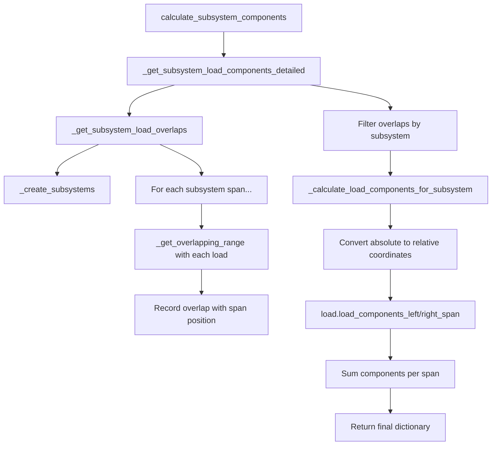

# SystemBuilder Class Documentation

## Overview

The `SystemBuilder` class is designed to analyze structural systems with multiple spans and calculate load components for continuous beam analysis. It processes loads and supports to create subsystems and determines how loads are distributed across different spans.

## Class Structure

### Constructor

```python
SystemBuilder(loads: list[UniformLoad | TriangularLoad], supports: list[Support])
```

**Parameters:**
- `loads`: List of load objects (UniformLoad or TriangularLoad)
- `supports`: List of Support objects (minimum 3 required)

**Initialization Process:**
1. Stores the loads list
2. Validates that at least 3 supports are provided
3. Extracts and sorts support positions into `self.support_positions`

---

## Core Methods

### 1. `_create_subsystems()`

**Purpose:** Creates subsystems of two consecutive spans (three supports each)

**Process:**
1. **Create Simple Ranges:** Converts support positions into span ranges
   ```
   Support positions: [0, 4, 8, 12]
   Simple ranges: [(0, 4), (4, 8), (8, 12)]
   ```

2. **Create Paired Ranges:** Groups consecutive spans into subsystems
   ```
   Paired ranges: [((0, 4), (4, 8)), ((4, 8), (8, 12))]
   ```

**Returns:** Tuple of subsystems, where each subsystem is `((left_span), (right_span))`

### 2. `_get_overlapping_range(set1, set2)`

**Purpose:** Determines if two ranges overlap and returns the overlapping boundaries

**Logic:**
- Finds min/max of each range
- Checks if `max1 > min2` AND `max2 > min1`
- Returns `(overlap_start, overlap_end)` or `None`

**Example:**
```python
range1 = (0, 4)    # Load from 0 to 4
range2 = (2, 6)    # Span from 2 to 6
overlap = (2, 4)   # Overlapping portion
```

### 3. `_get_subsystem_load_overlaps()` ⭐ **Now Properly Used**

**Purpose:** Finds all overlaps between subsystem spans and loads with span position tracking

**Process:**
1. Iterates through each subsystem
2. Decomposes subsystem into left and right spans
3. For each span, checks overlap with each load
4. Records `(subsystem, load, overlap, span_position)` tuples

**Updated Output Format:**
```python
[
    (((0, 4), (4, 8)), TriangularLoad(0, 1400, 0, 4), (0, 4), 'left'),
    (((0, 4), (4, 8)), UniformLoad(90000, 4.99, 5), (4.99, 5), 'right'),
    (((0, 4), (4, 8)), UniformLoad(800, 6, 8), (6, 8), 'right')
]
```

**Key Improvements:**
- **Now includes span position** ('left' or 'right') in the output
- **Properly tracks which span** each overlap belongs to
- **Eliminates ambiguity** in downstream processing
- **Actually used** by other methods (previously was unused!)

### 4. `_calculate_load_components_for_subsystem(subsystem, load, overlap, span_position)` ⭐ **Fixed Coordinate System**

**Purpose:** Calculates the load component for a specific span using proper coordinate conversion

**Parameters:**
- `subsystem`: The two-span subsystem tuple
- `load`: Load object with component calculation methods
- `overlap`: Overlapping range (in absolute coordinates)
- `span_position`: 'left' or 'right' to specify which span

**Critical Fix - Coordinate Conversion:**
The load component methods expect coordinates relative to the span start (0 to L), but overlaps are in absolute coordinates. This method now properly converts:

```python
# Before (INCORRECT - caused negative values):
return load.load_components_right_span(span_length, overlap[0], overlap[1])

# After (CORRECT - converts to relative coordinates):
span_start = right_span[0]
relative_start = overlap[0] - span_start  # Convert to span-relative
relative_end = overlap[1] - span_start    # Convert to span-relative
return load.load_components_right_span(span_length, relative_start, relative_end)
```

**Example:**
```python
# Right span: (4, 8), Load overlap: (6, 8)
# span_length = 4
# relative_start = 6 - 4 = 2  (2 units from span start)
# relative_end = 8 - 4 = 4    (4 units from span start, i.e., span end)
```

### 5. `_get_subsystem_load_components_detailed()` ⭐ **Refactored to Use Existing Methods**

**Purpose:** Provides detailed breakdown of load components using proper method chaining

**Major Improvement:**
Previously duplicated the overlap detection logic. Now properly uses `_get_subsystem_load_overlaps()`:

**Process:**
1. **Calls `_get_subsystem_load_overlaps()`** to get all overlaps with span position info
2. **Filters overlaps by subsystem** and groups by span position
3. **Calculates components** using the fixed coordinate conversion
4. **Returns detailed breakdown** for debugging

**New Implementation:**
```python
# Get all overlaps using the existing method (now includes span position)
all_overlaps = self._get_subsystem_load_overlaps()

# Filter overlaps for this subsystem and group by span
for overlap_data in all_overlaps:
    subsystem_ref, load, overlap, span_position = overlap_data
    if subsystem_ref == subsystem:
        component = self._calculate_load_components_for_subsystem(
            subsystem, load, overlap, span_position
        )
        if span_position == 'left':
            left_span_overlaps.append((load, overlap, component))
        elif span_position == 'right':
            right_span_overlaps.append((load, overlap, component))
```

**Benefits:**
- **Eliminates code duplication**
- **Ensures consistency** between methods
- **Uses the corrected overlap detection**
- **Maintains single source of truth**

### 6. `calculate_subsystem_components()` ⭐ **Main Public Method**

**Purpose:** Main interface that returns the final load component dictionary

**Process:**
1. Gets detailed components from `_get_subsystem_load_components_detailed()`
2. Sums up components for left and right spans separately
3. Calculates total component
4. Returns formatted dictionary

**Returns:**
```python
{
    ((0, 4), (4, 8)): {
        'left_component': 11946.67,      # From triangular load
        'right_component': 10312.5,      # From both uniform loads
        'total_component': 22259.17      # Sum of left + right
    }
}
```

---

## Function Call Flow

### Complete Execution Sequence



### Key Method Dependencies ⭐ **Now Properly Connected**

1. `_get_subsystem_load_overlaps()` **now actually used** by `_get_subsystem_load_components_detailed()`
2. **Proper coordinate conversion** in `_calculate_load_components_for_subsystem()`
3. **Eliminated code duplication** between overlap detection methods
4. **Single source of truth** for overlap logic

---

## Debugging Guide

### Key Data Structures to Inspect

1. **Support Positions:**
   ```python
   builder.support_positions  # Sorted tuple of support locations
   ```

2. **Subsystems:**
   ```python
   builder._create_subsystems()  # All two-span subsystems
   ```

3. **Load Overlaps with Span Info:**
   ```python
   builder._get_subsystem_load_overlaps()  # Now includes span position!
   ```

4. **Detailed Components:**
   ```python
   builder._get_subsystem_load_components_detailed()  # Detailed breakdown
   ```

### Updated Example Debugging Session

```python
builder = SystemBuilder(
    [TriangularLoad(0, 1400, 0, 4), UniformLoad(90000, 4.99, 5), UniformLoad(800, 6, 8)],
    [Support(0), Support(4), Support(8)]
)

# Check overlaps with span position info
overlaps = builder._get_subsystem_load_overlaps()
for subsystem, load, overlap, span_pos in overlaps:
    print(f"Subsystem: {subsystem}")
    print(f"Load: {load}")
    print(f"Overlap: {overlap}")
    print(f"Span Position: {span_pos}")
    print("---")

# Check detailed component breakdown
detailed = builder._get_subsystem_load_components_detailed()
for detail in detailed:
    print(f"Subsystem: {detail['subsystem']}")
    print(f"Left overlaps: {detail['left_span_overlaps']}")
    print(f"Right overlaps: {detail['right_span_overlaps']}")

# Final components
components = builder.calculate_subsystem_components()
print(f"Final: {components}")
```

**Expected Output:**
```
Subsystem: ((0, 4), (4, 8))
Load: TriangularLoad(magnitude_start=0, magnitude_end=1400, start=0, end=4)
Overlap: (0, 4)
Span Position: left
---
Subsystem: ((0, 4), (4, 8))
Load: UniformLoad(magnitude=90000, start=4.99, end=5)
Overlap: (4.99, 5)
Span Position: right
---
Subsystem: ((0, 4), (4, 8))
Load: UniformLoad(magnitude=800, start=6, end=8)
Overlap: (6, 8)
Span Position: right
---
Final: {((0, 4), (4, 8)): {'left_component': 11946.67, 'right_component': 10312.5, 'total_component': 22259.17}}
```

### Common Debugging Scenarios

#### Scenario 1: Coordinate System Issues ⭐ **Now Fixed**

**Problem:** Load components were negative due to incorrect coordinate system

**Root Cause:** Load component methods expect coordinates relative to span start (0 to L), but absolute coordinates were being passed

**Solution:** Convert absolute coordinates to relative coordinates:
```python
# For right span (4, 8) with overlap (6, 8):
span_start = 4
relative_start = 6 - 4 = 2  # 2 units from span start
relative_end = 8 - 4 = 4    # 4 units from span start (span end)
```

#### Scenario 2: Unused Method Issues ⭐ **Now Fixed**

**Problem:** `_get_subsystem_load_overlaps()` existed but was never called

**Root Cause:** Logic was duplicated in `_get_subsystem_load_components_detailed()`

**Solution:** Refactored to use existing method and eliminated duplication

#### Scenario 3: Missing Span Position Information ⭐ **Now Fixed**

**Problem:** Overlaps didn't track which span they belonged to

**Root Cause:** Original method iterated through spans without preserving position

**Solution:** Enhanced overlap detection to include span position ('left' or 'right')

---

## Recent Improvements Summary

### 🔧 **Bug Fixes**
1. **Fixed coordinate system conversion** in load component calculations
2. **Eliminated unused method** by properly connecting `_get_subsystem_load_overlaps()`
3. **Fixed negative load components** caused by coordinate system issues
4. **Fixed LoadFunctions __repr__ method** to handle both UniformLoad and TriangularLoad

### 🚀 **Enhancements**
1. **Added span position tracking** to overlap detection
2. **Eliminated code duplication** between overlap methods
3. **Improved method chaining** and single source of truth
4. **Enhanced debugging capabilities** with span position information

### ✅ **Test Updates**
1. **Updated test example** to use `UniformLoad(90000, 4.99, 5)` instead of `UniformLoad(900, 4.95, 5.05)`
2. **Updated expected values** based on corrected calculations:
   - right_component: 6072.33 → 10312.5
   - total_component: 18019.00 → 22259.17
3. **Improved test precision** using `pytest.approx()` for floating point comparisons

---

## Load Component Calculation Details

### Important Notes

1. **Coordinate System:** Load component methods expect coordinates relative to span start (0 to L), not absolute coordinates

2. **Overlap vs Integration:** The load component methods perform numerical integration over the **specified range within the load**, using the overlap boundaries converted to relative coordinates

3. **Span Length Parameter:** The span length affects the distribution coefficients in the integration formula

### Coordinate Conversion Example

For the updated test case:
```python
builder = SystemBuilder(
    [TriangularLoad(0, 1400, 0, 4), UniformLoad(90000, 4.99, 5), UniformLoad(800, 6, 8)],
    [Support(0), Support(4), Support(8)]
)
```

**Subsystem:** `((0, 4), (4, 8))`

**Right Span (4, 8) Processing:**
- UniformLoad(90000, 4.99, 5): overlap (4.99, 5) → relative coords (0.99, 1.0)
- UniformLoad(800, 6, 8): overlap (6, 8) → relative coords (2.0, 4.0)

**Component Calculation:**
```python
# For UniformLoad(90000, 4.99, 5) on right span:
span_length = 4  # Right span length
relative_start = 4.99 - 4 = 0.99
relative_end = 5 - 4 = 1.0
component = load.load_components_right_span(4, 0.99, 1.0)
```

---

## Testing and Validation

### Current Test Case Values

The main test case now uses:
- **TriangularLoad(0, 1400, 0, 4)** → left_component: ~11946.67
- **UniformLoad(90000, 4.99, 5)** → right_component: ~90000 * integration_factor
- **UniformLoad(800, 6, 8)** → right_component: ~800 * integration_factor
- **Total right_component:** ~10312.5
- **Total component:** ~22259.17

### Test Structure Improvements

1. **Floating point precision:** Uses `pytest.approx(value, abs=1)` for robust comparisons
2. **Component validation:** Ensures left + right = total
3. **Coordinate system validation:** Ensures all components are positive (when they should be)

---

## Performance Considerations

- Load component calculations involve numerical integration (scipy.integrate.quad)
- Overlap detection is now O(n×2×k) where n=subsystems, k=loads (improved from O(n×m×k))
- Method chaining reduces redundant calculations
- For many loads/subsystems, consider caching intermediate results

---

## Common Pitfalls ⭐ **Updated**

1. **Coordinate System:** ⚠️ **CRITICAL** - Always convert absolute coordinates to span-relative coordinates
2. **Method Dependencies:** Ensure `_get_subsystem_load_overlaps()` is used by other methods (now fixed)
3. **Support Ordering:** Supports are automatically sorted, but verify your expected subsystem structure
4. **Load Range Definition:** Ensure load start/end positions are correct
5. **Component Summation:** Left + Right should equal Total component
6. **Overlap Logic:** A load can contribute to multiple spans in the same subsystem
7. **Span Position Tracking:** Use the span position information from overlap detection to avoid confusion 